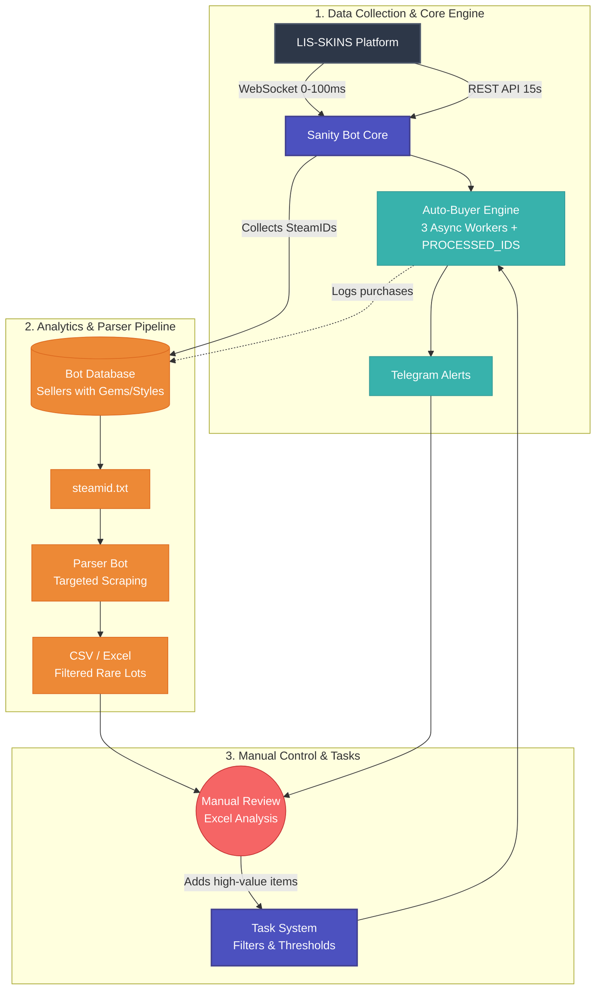

# 🎯 SanityBot (LIS-SKINS Trading Bot)

> **High-performance asynchronous trading bot for [LIS-SKINS](https://lis-skins.com)** with real-time WebSocket notifications and instant auto-purchase. No `check_availability()` delays — direct purchase saves 200–400ms per item.


---

## ✨ Features

### Core
- **Real-time WebSocket notifications** — 0–100ms latency for new listings
- **Instant auto-purchase** — direct `POST /market/buy` without `check_availability()` (saves 200–400ms)
- **Flexible task system** — filter by item name, gems, styles, max price
- **Hybrid polling + WebSocket** — backup REST polling every 15s for reliability
- **Mass import/export** — add 100+ tasks via text: `Item Name;max_price;max_quantity;rule_type;rule_value`
- **Quick quantity adjustment** — `➕` `➖` buttons in task list
- **Automatic retry** — handles network errors and rate limits (HTTP 429)
- **Steam seller database** — auto-collects SteamIDs of sellers with gems/styles
- **Telegram bot** — manage tasks and receive notifications

### Advanced
- **3 async workers** — parallel item processing (tunable)
- **Duplicate protection** — `PROCESSED_IDS` with TTL prevents double-buying
- **Atomic JSON writes** — protects `tasks.json` from corruption on concurrent writes
- **Rate limit handling** — exponential backoff on 429 errors
- **Self-populating bot database** — collects seller data for pre-scan analysis

**Result:** Semi-automated pipeline with manual control over high-value items

---

## 🛠 Tech Stack

| Technology | Purpose |
|---|---|
| Python 3.12+ | Core language |
| aiohttp | Async HTTP requests |
| Centrifuge | WebSocket client for real-time notifications |
| python-telegram-bot | Telegram bot framework |
| SQLite | Steam seller database |
| asyncio | Async architecture |
| JSON | Task storage (atomic writes) |

---

## 📊 Architecture


---
### Data Pipeline
1. **Collection** — WebSocket collects seller SteamIDs → Bot Database
2. **Parsing** — Parser bot scans specific items from steamid.txt → CSV
3. **Manual Review** — Filter promising items in Excel
4. **Auto-Trading** — Add to tasks (via import or UI) → Sanity Bot auto-purchases

## 🎯 Architecture Trade-offs

### Why JSON instead of SQLite for tasks?
- **Latency:** In-memory cache + atomic JSON writes = ~5ms vs ~15ms for SQLite transactions
- **Simplicity:** Single file backup/restore, no WAL files
- **Volume:** <1000 tasks = JSON is faster and simpler

### Why PROCESSED_IDS with TTL instead of strict idempotency?
- **Business goal:** Snipe ultra-rare items with 300%+ margin
- **Trade-off:** Accepting potential double-purchase (capital lockup for 5 min) 
  is better than missing the item due to DB latency
- **Protection:** TTLCache prevents OOM, atomic writes prevent corruption

---

## ⚙️ Performance Tuning & Configuration

The bot is designed for fine-grained control to balance speed with API rate limits. Key parameters are tunable based on marketplace load:

- `WORKER_COUNT`: Adjusted dynamically (e.g., 3–7 workers). Higher counts increase throughput but risk HTTP 429 errors.
- `POLL_INTERVAL_SECONDS`: Set to ~15s as a sweet spot between data freshness and server load.
- `MAX_CURSOR_PAGES_PER_TASK`: Limits pagination depth (e.g., 15 pages) to prevent memory spikes and long-running blocking requests.
- **Sequential Fallback:** If parallel requests trigger rate limits, the system gracefully degrades to sequential processing to maintain 0% error rate.

| Optimization | Impact |
|--------------|--------|
| WebSocket instead of polling | 0–100ms vs 15s |
| No `check_availability()` | -200–400ms per purchase |
| In-memory task cache | -10–50ms per item |
| 3 async workers | Parallel processing |
| Retry + backoff | Stability on 429 |
| Atomic JSON writes | No file corruption |
| TTLCache for PROCESSED_IDS | No OOM crashes |

---

## 📈 Performance

Live timings from the bot console (one `Scan pass` = one REST polling cycle):

```log
2026-09-08 07:09:57,273 [INFO] lis-market-poller: Scan pass: min=0ms max=363ms avg=187ms | checked=232 matched=0
2026-09-08 07:10:24,083 [INFO] lis-market-poller: Polling scan_once started, enabled=True
2026-09-08 07:10:35,983 [INFO] lis-market-poller: Scan pass: min=0ms max=348ms avg=188ms | checked=232 matched=0
```

**Typical numbers:**

| Metric | Value |
|---|---|
| Polling cycle (REST fallback) | ~15s between scans |
| Items checked per pass | ~232–904 |
| Pass duration (min / avg / max) | ~0ms / ~187–188ms / ~348–363ms |
| Items matched per pass | 0–5 (waiting for live signals) |
| 429 / rate-limit errors | 0 |

- **Item processing time:** 100–250ms
- **Polling cycle time:** ~15s
- **429 errors:** 0
- **Profit:** 300–1500% on rare items

---

## 📱 User Interface & Observability

**31+ million items checked** with full transparency — all metrics accessible via Telegram:

### Real-Time Monitoring:
- **Volume Metrics** — total checked, matched, sent to processor
- **Latency Tracking** — min/max/avg per scan cycle (typical: 0ms/3s/99ms)
- **Autobuy Status** — toggle on/off without restart
- **Polling Controls** — enable/disable REST fallback independently

### Example Dashboard:

---

## 🎯 Killer Features

1. **Self-populating bot database** — auto-collects SteamIDs of sellers with gems/styles via WebSocket
2. **Pre-scan marketplace** — check database for potential items before launching auto-buy
3. **Hybrid polling + WebSocket** — maximum speed + reliability
4. **Zero-duplicate protection** — `PROCESSED_IDS` with TTL prevents double-buying
5. **Atomic JSON writes** — protects `tasks.json` from corruption
6. **Mass import/export** — add 100+ tasks via text in one message

---

## 📝 Telegram Commands

| Command | Description |
|---|---|
| `/start` | Open main menu |
| `📋 My Tasks` | View tasks with `➕` `➖` buttons |
| `📝 Create Task` | Create task via wizard |
| `📥 Import Tasks` | Mass import: `Item Name;max_price;max_quantity;rule_type;rule_value` |
| `📤 Export Tasks` | Export all tasks to text |
| `💰 My Balance` | Show balance |
| `📊 Statistics` | Show polling stats |
| `🤖 Autobuy: ON/OFF` | Toggle auto-purchase |

---

## ⚙️ Configuration

```bash
# .env
API_KEY=your_api_key
BOT_TOKEN=your_telegram_bot_token
CHAT_ID=your_telegram_chat_id
WS_URL=wss://ws.lis-skins.com/connection/websocket
TRADE_PARTNER=your_steam_partner
TRADE_TOKEN=your_steam_token
ALLOWED_USER_IDS=your_telegram_user_id
```

> ⚠️ Never commit `.env` — keep secrets private.

---

## 📸 Screenshots

### Telegram Bot


### Auto-purchase Log


### Task Import


### Settings


---

## 🔮 Roadmap

- [ ] **Multi-account support** — parallel purchases from multiple accounts
- [ ] **Web dashboard** — stats, charts, task management
- [ ] **Integration with other marketplaces** — Steam, CS.MONEY, etc.
- [ ] **Balance check before purchase** — prevent capital lockup

---


## 🤝 Contributing

Contributions are welcome! Please open an issue or submit a PR.

## 📧 Contact

- **Telegram:** @sleept1ght
- **Email:** sleepti3ht@gmail.com
