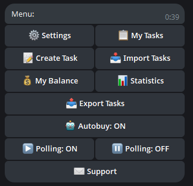
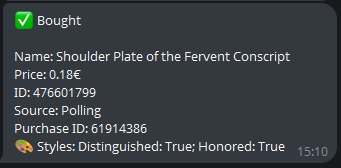
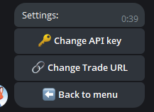

# 🎯 LIS-SKINS Trading Bot

> **High-performance asynchronous trading bot for [LIS-SKINS](https://lis-skins.com)** with real-time WebSocket notifications and instant auto-purchase. Semi-automated pipeline with manual control over high-value items.


---

## ✨ Features

### Core
- **Real-time WebSocket notifications** — 0–100ms latency for new listings
- **Instant auto-purchase** — no `check_availability()` delays (saves 200–400ms)
- **Flexible task system** — filter by item name, gems, styles, max price
- **Hybrid polling + WebSocket** — backup polling every 10–30s for reliability
- **Task caching** — in-memory cache to minimize file I/O delays
- **Automatic retry** — handles network errors and rate limits (HTTP 429)
- **Steam seller database** — auto-collects SteamIDs of sellers with gems/styles
- **Telegram bot** — manage tasks and receive notifications

### Advanced
- **3 async workers** — parallel item processing (tunable)
- **Duplicate protection** — `seen_ids` prevents double-buying
- **Rate limit handling** — exponential backoff on 429 errors
- **Self-populating bot database** — collects seller data for pre-scan analysis
- **Pre-scan marketplace** — check database before launching auto-buy

**Result:** Semi-automated pipeline with manual control over high-value items

---

## 🛠 Tech Stack

| Technology | Purpose |
|---|---|
| Python 3.12+ | Core language |
| aiohttp | Async HTTP requests |
| Centrifuge | WebSocket client for real-time notifications |
| aiogram | Telegram bot framework |
| SQLite | Task and stats storage |
| asyncio | Async architecture |

---

## 📊 Architecture


### Data Pipeline
1. **Collection** — WebSocket collects seller SteamIDs → Bot Database
2. **Parsing** — Parser bot scans specific items from steamid.txt → CSV
3. **Manual Review** — Filter promising items in Excel
4. **Auto-Trading** — Add to tasks → Sanity Bot auto-purchases

---

## ⚙️ Performance Tuning & Configuration

The bot is designed for fine-grained control to balance speed with API rate limits. Key parameters are tunable based on marketplace load:

- `WORKER_COUNT`: Adjusted dynamically (e.g., 3–7 workers). Higher counts increase throughput but risk HTTP 429 errors.
- `POLL_INTERVAL_SECONDS`: Set to ~15s as a sweet spot between data freshness and server load.
- `MAX_CURSOR_PAGES_PER_TASK`: Limits pagination depth (e.g., 30 pages) to prevent memory spikes and long-running blocking requests.
- **Sequential Fallback:** If parallel requests trigger rate limits, the system gracefully degrades to sequential processing to maintain 0% error rate.

| Optimization | Impact |
|--------------|--------|
| WebSocket instead of polling | 0–100ms vs 10–30s |
| No `check_availability()` | -200–400ms per purchase |
| In-memory task cache | -10–50ms per item |
| 3 async workers | Parallel processing |
| Retry + backoff | Stability on 429 |
| Sequential fallback | 0 429 errors |

---

## 📈 Performance

- **Item processing time:** 100–250ms
- **Polling cycle time:** 8–9 seconds
- **429 errors:** 0
- **Profit:** 300–1500% on rare items

---

## 🎯 Killer Features

1. **Self-populating bot database** — auto-collects SteamIDs of sellers with gems/styles via WebSocket
2. **Pre-scan marketplace** — check database for potential items before launching auto-buy
3. **Hybrid polling + WebSocket** — maximum speed + reliability
4. **Zero-duplicate protection** — `seen_ids` prevents double-buying

---

## 📝 Telegram Commands

| Command | Description |
|---|---|
| `/add` | Add a task (name, gem, style, max price) |
| `/list` | Show active tasks |
| `/del` | Delete a task |
| `/clear` | Clear all tasks |
| `/balance` | Show balance |
| `/stats` | Purchase statistics |

---

## ⚙️ Configuration

```bash
# .env
API_KEY=your_api_key
LISSKINS_API_URL=https://api.lis-skins.com
WS_URL=wss://ws.lis-skins.com/connection/websocket
TRADE_PARTNER=your_steam_partner
TRADE_TOKEN=your_steam_token
```

> ⚠️ Never commit `.env` — keep secrets private.

---

## 📸 Screenshots

### Telegram Bot


### Auto-purchase Log


### Settings


---

## 🔮 Roadmap

- [ ] **Multi-account support** — parallel purchases from multiple accounts
- [ ] **Web dashboard** — stats, charts, task management
- [ ] **Integration with other marketplaces** — Steam, CS.MONEY, etc.

---

## 🤝 Contributing

Contributions are welcome! Please open an issue or submit a PR.

## 📧 Contact

- **Telegram:** @sleept1ght
- **Email:** sleepti3ht@gmail.com
