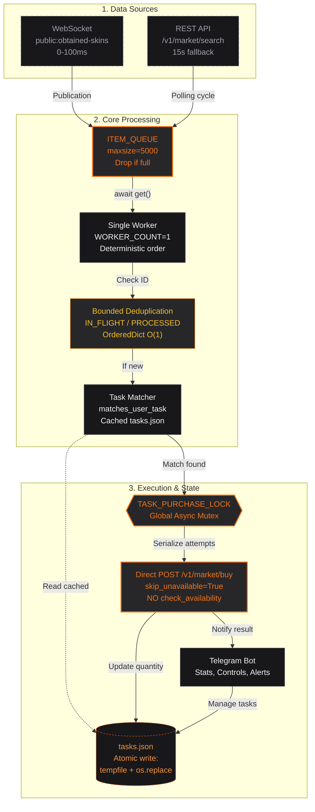
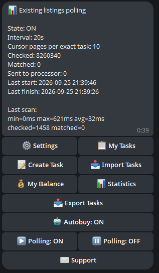
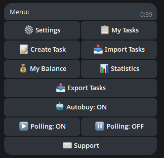
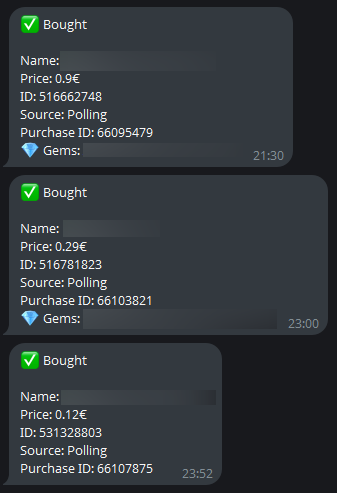
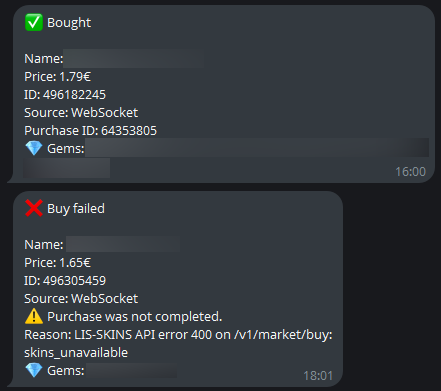
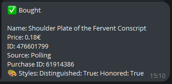
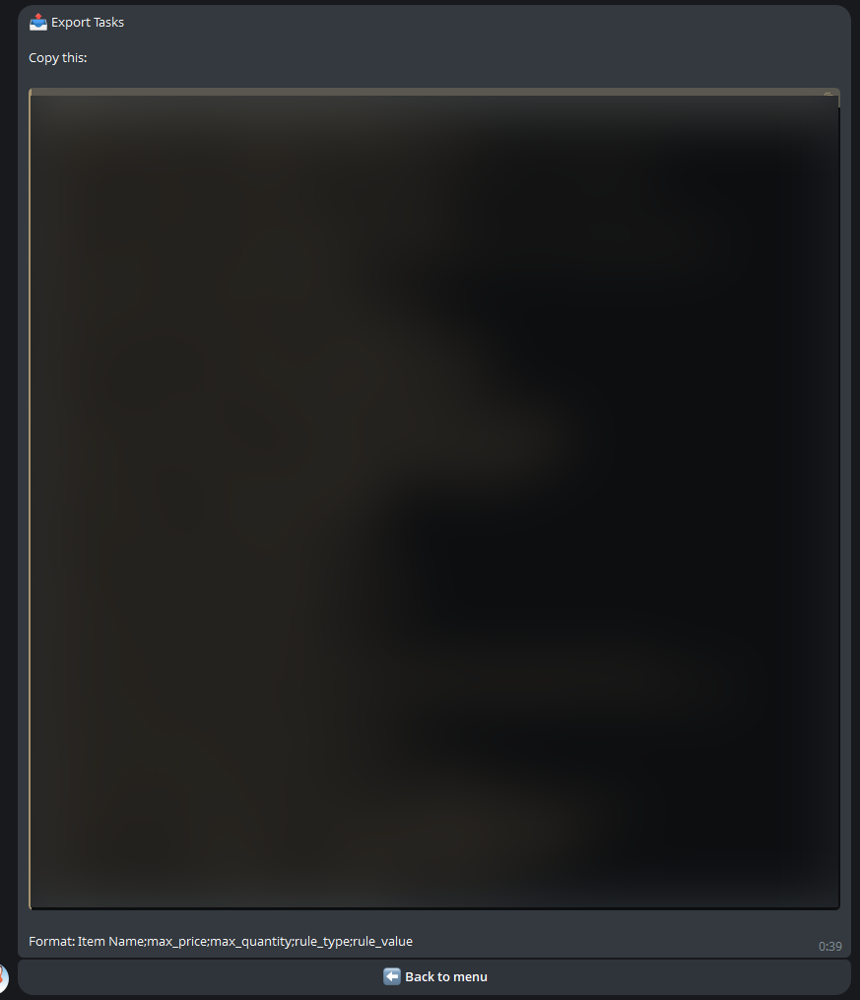
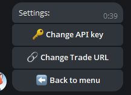

<div align="center">

# SanityBot

[](https://python.org)
[](https://github.com)
[](https://docs.python.org/3/library/asyncio.html)
[](LICENSE)

</div>

> ⚡ High-performance asynchronous trading bot for [LIS-SKINS](https://lis-skins.com). Real-time WebSocket ingestion, deterministic task matching, and instant auto-purchase. Zero `check_availability()` overhead saves 200–400ms per transaction.

---

## ⚡ Quick Start

```bash
# Clone and setup
git clone https://github.com/your-repo/sanitybot.git
cd sanitybot
python -m venv .venv && source .venv/bin/activate
pip install -r requirements.txt

# Configure environment
cp .env.example .env
# Edit .env with your API keys and credentials

# Run
python main.py
```

---


## ✨ Features

### Core
- **Real-time WebSocket notifications** — 0–100ms latency for new listings
- **Instant auto-purchase** — direct purchase request without `check_availability()` (saves 200–400ms)
- **Flexible task system** — filter by item name, gems, styles, max price
- **Hybrid polling + WebSocket** — backup REST polling every 15s for reliability
- **Mass import/export** — add 100+ tasks via text: `Item Name;max_price;max_quantity;rule_type;rule_value`
- **Quick quantity adjustment** — `➕` `➖` buttons in task list
- **Automatic retry** — handles network errors and rate limits (HTTP 429)
- **Steam seller database** — auto-collects SteamIDs of sellers with gems/styles
- **Telegram bot** — manage tasks and receive notifications

### Reliability
- **Single async processing worker** — preserves predictable purchase ordering
- **In-process duplicate protection** — shared bounded `OrderedDict` caches prevent repeated processing from WebSocket and polling
- **Atomic JSON replacement** — writes task updates through a temporary file and `os.replace()`
- **Retry handling** — retries selected network failures and respects HTTP 429 retry delays
- **Seller SQLite database** — records discovered seller SteamIDs and listing metadata when available in item payloads

**Result:** Semi-automated pipeline with manual control over high-value items

---

## 🛠 Tech Stack

| Technology | Purpose |
|---|---|
| Python 3.12+ | Core language |
| aiohttp | Async HTTP requests |
| Centrifuge | WebSocket client for real-time notifications |
| python-telegram-bot | Telegram bot framework |
| SQLite | Steam seller database |
| asyncio | Async architecture |
| JSON | Task storage (atomic writes) |

---

## 📊 Architecture


```mermaid
graph TD
    %% --- Dark UI + Dark Orange Styles ---
    classDef darkBg fill:#18181b,stroke:#3f3f46,color:#f4f4f5,stroke-width:1px
    classDef orangeAccent fill:#27272a,stroke:#f97316,color:#f97316,stroke-width:2px
    classDef amberAccent fill:#27272a,stroke:#d97706,color:#fbbf24,stroke-width:1px
    classDef source fill:#18181b,stroke:#71717a,color:#a1a1aa,stroke-width:1px,stroke-dasharray: 5 5
    classDef storage fill:#18181b,stroke:#ea5806,color:#fb923c,stroke-width:1px,stroke-dasharray: 3 3

    %% --- 1. Data Sources ---
    subgraph Sources ["1. Data Sources"]
        direction LR
        WS["WebSocket<br>public:obtained-skins<br>0-100ms"]:::source
        REST["REST API<br>/v1/market/search<br>15s fallback"]:::source
    end

    %% --- 2. Core Processing ---
    subgraph Core ["2. Core Processing"]
        direction TB
        Q["ITEM_QUEUE<br>maxsize=5000<br>Drop if full"]:::orangeAccent
        W["Single Worker<br>WORKER_COUNT=1<br>Deterministic order"]:::darkBg
        DEDUP["Bounded Deduplication<br>IN_FLIGHT / PROCESSED<br>OrderedDict O(1)"]:::amberAccent
        MATCH["Task Matcher<br>matches_user_task<br>Cached tasks.json"]:::darkBg
    end

    %% --- 3. Execution & State ---
    subgraph Execution ["3. Execution & State"]
        direction TB
        LOCK{{"TASK_PURCHASE_LOCK<br>Global Async Mutex"}}:::orangeAccent
        BUY["Direct POST /v1/market/buy<br>skip_unavailable=True<br>NO check_availability"]:::orangeAccent
        JSON[("tasks.json<br>Atomic write:<br>tempfile + os.replace")]:::storage
        TG["Telegram Bot<br>Stats, Controls, Alerts"]:::darkBg
    end

    %% --- Connections ---
    WS -->|Publication| Q
    REST -->|Polling cycle| Q
    Q -->|"await get()"| W
    W -->|"Check ID"| DEDUP
    DEDUP -->|"If new"| MATCH
    MATCH -.->|"Read cached"| JSON
    MATCH -->|"Match found"| LOCK
    LOCK -->|"Serialize attempts"| BUY
    BUY -->|"Update quantity"| JSON
    BUY -->|"Notify result"| TG
    TG -->|"Manage tasks"| JSON
```
---
### Data Pipeline
> The seller parser and CSV/Excel analysis pipeline are separate private tools.
> They consume seller data collected by SanityBot and are not included in this repository.
1. **Collection** — WebSocket collects seller SteamIDs → Bot Database
2. **Parsing** — Parser bot scans specific items from steamid.txt → CSV
3. **Manual Review** — Filter promising items in Excel
4. **Auto-Trading** — Add to tasks (via import or UI) → Sanity Bot auto-purchases

## Architecture trade-offs

### Why JSON for tasks?
- **Simplicity:** Tasks are stored in one readable and portable `tasks.json` file.
- **Small-scale workload:** For a personal bot with a limited number of tasks, JSON is sufficient and easy to back up.
- **Safe replacement:** Task updates use a temporary file followed by `os.replace()` to avoid partial JSON files if a write is interrupted.
- **Trade-off:** JSON is not a replacement for a transactional multi-process database. The bot is designed to run as one process.

### Why bounded in-memory deduplication?
- **Goal:** Avoid processing the same listing twice when it arrives through WebSocket, polling, or repeated events.
- **Mechanism:** `IN_FLIGHT_IDS` blocks simultaneous handling; `PROCESSED_IDS` remembers recently processed IDs.
- **Memory safety:** Both caches have maximum sizes and evict the oldest IDs when full.
- **Trade-off:** This is in-process best-effort deduplication, not durable idempotency across restarts.

---

## ⚙️ Configuration and tuning

The bot prioritizes fast WebSocket handling and keeps REST polling as a fallback for existing listings.

- `WORKER_COUNT`: Number of queue workers for item processing. The current default is `1`, which keeps purchase attempts ordered and works with the global purchase lock.
- `POLL_INTERVAL_SECONDS`: Delay between REST polling cycles. The current value is `15`.
- `MAX_CURSOR_PAGES_PER_TASK`: Maximum number of pagination pages scanned for one exact-name task. The current value is `15`.
- `MAX_PROCESSED`: Maximum number of recently processed listing IDs kept in memory.
- `MAX_IN_FLIGHT`: Maximum number of listing IDs currently marked as being processed.
- `ITEM_QUEUE` size: Maximum number of incoming items waiting for processing before new events are dropped and logged.

The following timings are from current production/test runs and are continuously visible in the bot logs and Telegram Statistics.
Actual latency depends on marketplace load, network conditions, and the number of active tasks.
Increasing polling intensity or worker count may increase API load, rate-limit risk, and duplicate-purchase complexity. Measure with logs before changing these values.

| Optimization | Impact |
|--------------|--------|
| WebSocket instead of polling | 0–100ms vs 15s |
| No `check_availability()` | -200–400ms per purchase |
| In-memory task cache | -10–50ms per item |
| Async processing workers | configurable parallel item intake and matching; purchase attempts remain protected by a global lock |
| Retry + backoff | Stability on 429 |
| Atomic JSON replacement | Protects tasks.json from interrupted-write corruption |
| Bounded `OrderedDict` ID caches | Prevents unbounded memory growth |

---

## 📈 Performance

Live timings from the bot console (one `Scan pass` = one REST polling cycle):

```log
2026-09-08 07:09:57,273 [INFO] lis-market-poller: Scan pass: min=0ms max=363ms avg=187ms | checked=232 matched=0
2026-09-08 07:10:24,083 [INFO] lis-market-poller: Polling scan_once started, enabled=True
2026-09-08 07:10:35,983 [INFO] lis-market-poller: Scan pass: min=0ms max=348ms avg=188ms | checked=232 matched=0
```

**Typical numbers:**

| Metric | Value |
|---|---|
| Polling cycle (REST fallback) | ~15s between scans |
| Items checked per pass | ~232–904 |
| Pass duration (min / avg / max) | ~0ms / ~187–188ms / ~348–363ms |
| Items matched per pass | 0–5 (waiting for live signals) |
| 429 / rate-limit errors | 0 in current observed runs |

- **Item processing time:** 100–250ms
- **Polling cycle time:** ~15s
- **429 errors:** 0
- **Profit:** 300–1500% on rare items

---

## 📱 User Interface & Observability

**31+ million items checked** with full transparency — all metrics accessible via Telegram:

### Real-Time Monitoring:
- **Volume Metrics** — total checked, matched, sent to processor
- **Latency Tracking** — min/max/avg duration for every scan cycle, visible in Telegram Statistics
- **Autobuy Status** — toggle on/off without restart
- **Polling Controls** — enable/disable REST fallback independently

### Example Dashboard:

---

## 🎯 Killer Features

1. **Self-populating bot database** — auto-collects SteamIDs of sellers with gems/styles via WebSocket
2. **Pre-scan marketplace** — check database for potential items before launching auto-buy
3. **Hybrid polling + WebSocket** — maximum speed + reliability
4. **Duplicate protection** — bounded `PROCESSED_IDS` and `IN_FLIGHT_IDS` caches prevent duplicate processing
5. **Atomic JSON writes** — protects `tasks.json` from corruption
6. **Mass import/export** — add 100+ tasks via text in one message

---


## 📱 Telegram Interface

| Command / Action | Description |
|---|---|
| `/start` | Open main control menu |
| `📋 My Tasks` | View active tasks with `➕` `➖` quantity controls |
| `📝 Create Task` | Interactive wizard for new task creation |
| `📥 Import Tasks` | Bulk import via formatted text block |
| `📤 Export Tasks` | Dump current configuration to text |
| `💰 My Balance` | Fetch current LIS-SKINS account balance |
| `📊 Statistics` | View real-time polling latency and volume metrics |
| `🤖 Autobuy: ON/OFF` | Toggle execution engine without restarting the daemon |

---

## ⚙️ Configuration

```bash
# .env
API_KEY=your_api_key
BOT_TOKEN=your_telegram_bot_token
CHAT_ID=your_telegram_chat_id
WS_URL=wss://ws.lis-skins.com/connection/websocket
TRADE_PARTNER=your_steam_partner
TRADE_TOKEN=your_steam_token
ALLOWED_USER_IDS=your_telegram_user_id
```

> ⚠️ Never commit `.env` — keep secrets private.

---

## 📸 Screenshots

### Telegram Bot



### Auto-purchase Log




### Task Import


### Settings


---

## 🔮 Roadmap

- [ ] **Multi-account support** — parallel purchases from multiple accounts
- [ ] **Web dashboard** — stats, charts, task management
- [ ] **Integration with other marketplaces** — Steam, CS.MONEY, etc.
- [ ] **Balance check before purchase** — prevent capital lockup

---


## 🤝 Contributing

Contributions are welcome! Please open an issue or submit a PR.


